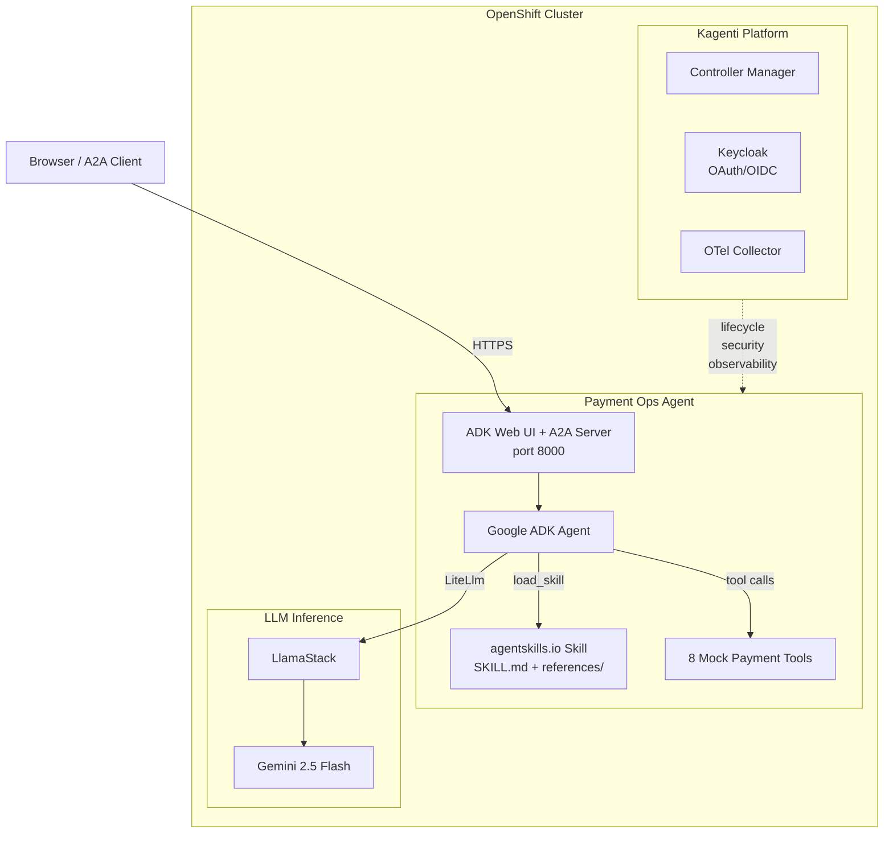
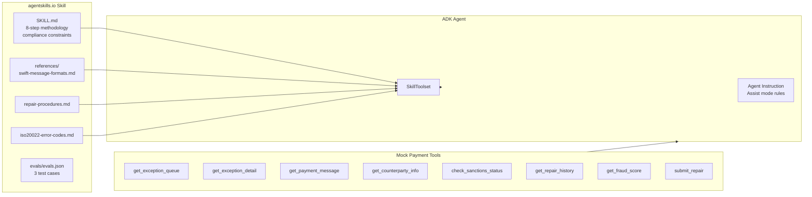
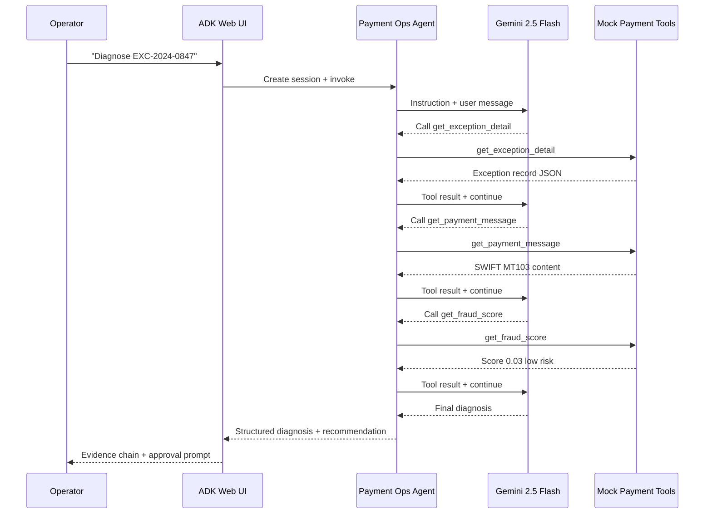
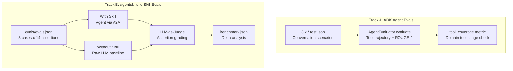

# Payments, Reimagined — Agent at the Operational Seam

**Red Hat Summit 2026 Demo** | Wed May 13, B404

## Live Demo

**ADK Web UI**: https://payment-ops-rhs26-payments-demo.apps.cluster-6crhb.6crhb.sandbox1011.opentlc.com

Open that URL in a browser, select `payment_ops`, and start typing prompts.

See [HANDOFF.md](HANDOFF.md) for the complete demo guide and [DEMO_NARRATIVE.md](DEMO_NARRATIVE.md) for the full talk track.

---

## What This Demonstrates

A Google ADK agent sitting at the **operational seam** between payment platforms — the expensive, manual space where exceptions concentrate. The agent:

1. Reviews a queue of payment exceptions (missing BIC, amount mismatch, sanctions hold, duplicate)
2. Pulls the original SWIFT MT103 message and cross-references counterparty, sanctions, and fraud data
3. Checks historical repair patterns and ML fraud scores
4. Presents a structured diagnosis with evidence and confidence level
5. Recommends a repair action — but **waits for human approval** before executing

All payment tools return **mock data** — no real payment systems required. The LLM (Gemini 2.5 Flash via LlamaStack) is the only live dependency.

---

## Quick Start (Local)

```bash
# Install
pip install -e ".[dev]"

# Copy env and edit if needed
cp .env.example .env

# Run with ADK Web UI (recommended -- same as deployed version)
PYTHONPATH=. adk web --host 0.0.0.0 --port 8006 --session_service_uri memory:// agents

# Or run A2A-only server (no UI)
PYTHONPATH=. uvicorn agents.payment_ops.server:app --host 0.0.0.0 --port 8006
```

Then open http://localhost:8006 in your browser.

```bash
# Test health (A2A-only mode)
curl http://localhost:8006/healthz

# Run unit tests
NEO4J_PASSWORD=notused pytest tests/ -v
```

---

## Demo Prompts (copy-paste)

```
Show me today's exception queue.
```

```
Diagnose exception EXC-2024-0847. Show me your full diagnosis with all evidence before recommending any action.
```

```
Approved. Submit the repair for EXC-2024-0847.
```

```
Now check the sanctions hold on EXC-2024-0853. Full diagnosis please.
```

---

## Mock Exception Scenarios

| ID | Type | Root Cause | Agent Action |
|----|------|-----------|-------------|
| EXC-2024-0847 | Missing BIC | :57A field empty in MT103 | Resolves BIC from IBAN, recommends repair |
| EXC-2024-0851 | Amount Mismatch | USD 50K vs 5K | Flags discrepancy, escalates (policy CP-PAY-007) |
| EXC-2024-0853 | Sanctions Hold | OFAC fuzzy match (0.31) | Identifies false positive, notes compliance sign-off required |
| EXC-2024-0856 | Duplicate Payment | Same ref submitted twice | Recommends reject, links to original |

---

## Architecture

### Platform Stack



### Agent Internals



### Request Flow



### Eval System



### File Structure

```
agents/payment_ops/
├── agent.py                    # ADK Agent + SkillToolset + 8 tools
├── server.py                   # A2A + ADK Web UI server
├── skills/exception-repair/
│   ├── SKILL.md                # agentskills.io repair methodology
│   ├── references/             # L3 domain knowledge
│   │   ├── swift-message-formats.md
│   │   ├── repair-procedures.md
│   │   └── iso20022-error-codes.md
│   └── evals/evals.json        # Skill quality test cases
└── evals/                      # ADK eval datasets (3 scenarios)

shared/
├── payment_tools.py            # 8 mock tools (swap-ready for real APIs)
├── model_config.py             # Config loader (config.yaml + env vars)
├── eval_metrics.py             # Custom tool_coverage metric
├── skill_eval_runner.py        # agentskills.io with/without-skill runner
└── health.py                   # /healthz + /readyz endpoints

tests/
├── test_payment_ops.py         # 19 unit tests (agent + tools)
├── test_agent_evals.py         # ADK AgentEvaluator (needs live LLM)
└── test_skill_evals.py         # Skill eval data integrity + execution
```

---

## Deploy to OpenShift

```bash
# Set required env vars first
export KEYCLOAK_USER=your-user
export KEYCLOAK_PASSWORD=your-password

# Deploy via Kagenti
scripts/deploy_kagenti.sh
```

Or via container build:
```bash
docker build -t payment-ops -f Dockerfile .
docker run -p 8006:8000 -e NEO4J_PASSWORD=notused payment-ops
```

---

## Run Tests

```bash
NEO4J_PASSWORD=notused pytest tests/ -v
```

## License

Apache 2.0
